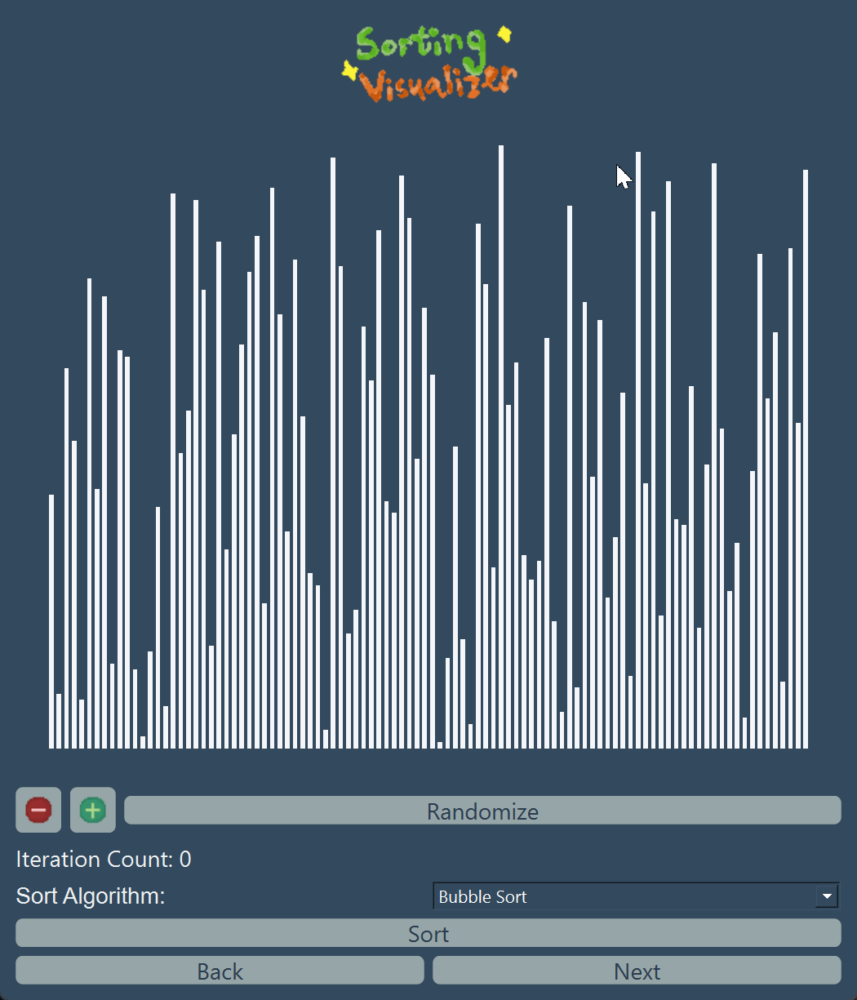

# Sorting Visualizer 
The Sorting Visualizer project helps users understand how different sorting algorithms work by providing a visual representation of their operation
## Features 
- View how three simple sorting algorithms work
    - Bubble Sort
    - Selection Sort
    - Insertion Sort 


## Installation in terminal


```bash
pip install -r requirements.txt
```

## Usage

```python

```
## Built With 
- Python 
- PyQt 6

## Milestones ✨
- [x] 3 simple sorting algorithms 
- [x] Animation for sorting algorithm
- [x] Increase/Decrease number of data 
- [ ] More sorting algorithms
- [ ] Prettier UI
- [ ] Increase speed of animation
## Contributing

Pull requests are welcome. For major changes, please open an issue first
to discuss what you would like to change.

Please make sure to update tests as appropriate.

## License

[MIT](https://choosealicense.com/licenses/mit/)